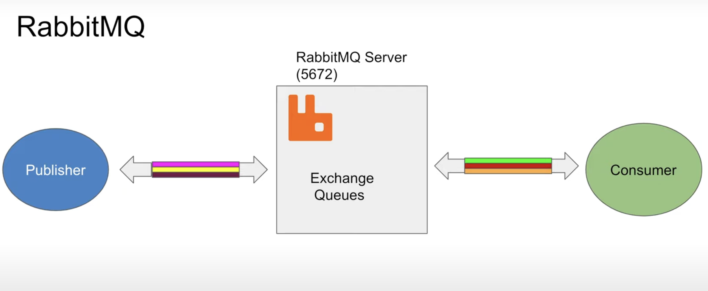
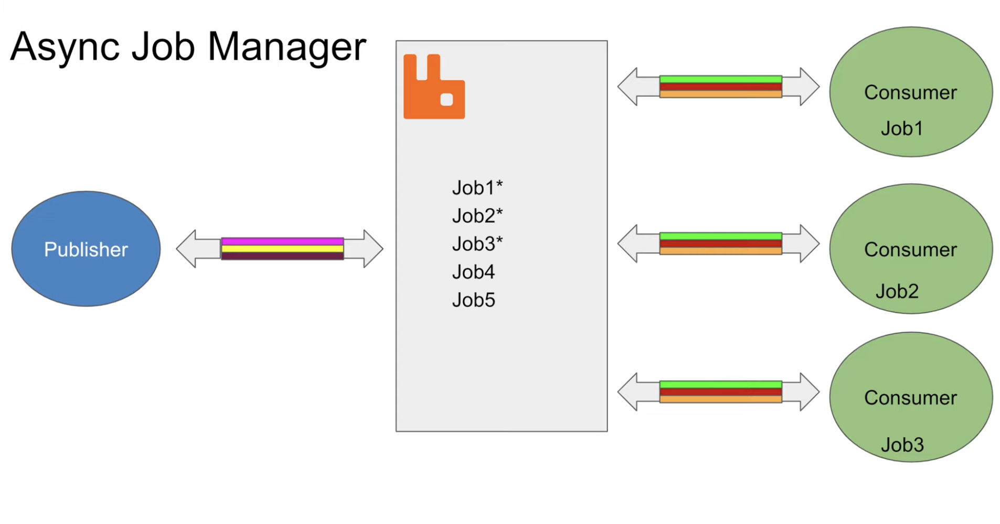

# RabbitMQ

These are my short notes about RabbitMQ

## Table of Contents

- [RabbitMQ Components](#RabbitMQ_Components)
- [Write a Publisher client NodeJS](#publisher)
- [Write a Consumer client NodeJS](#consumer)
- [Summary](#summary)

## RabbitMQ Components
1. RabbitMQ solves problem to communicating with many clients.
2. It has layer
3. Components:
    ```
    3.1. RabbitMQ Server
    3.2. Publisher: Under lying protocol is TCP. Two-way communication between Server and Publisher. Publisher sends messages to the server.
    3.3. Consumer: Who consumes messages. Under lying protocol is TCP (AMQP-Advanced Message Queue Protocol). Server pushes messages to the consumer when they are ready.
    ```
4. A channel is a logical connection between the components.
5. It uses Multiplexing (Multiple channels over the same TCP connection). HTTP/2 uses multiplexing as well. So, publisher/ consumer can communicate with the server over channels.
6. If you will not use channels you will be forced to use multiple publisher/ consumer.
7. All the information send by the publisher will come in the queue. The consumer will pull information from the queue.



8. Publisher/ Consumer are not aware of queues. They aware of exchanges (another abstraction in RabbitMQ).

We will build a Async Job Engine


## Write a Publisher client NodeJS
Instructions on how to use the project.

## Write a Consumer client NodeJS

Guidelines on how to contribute to the project.

## Summary

Information about the project's license.
